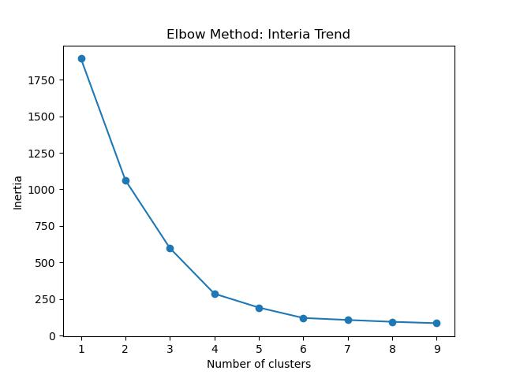
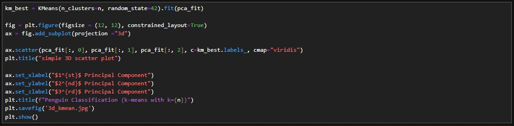

# Penguins_Unsupervised_Classification

This is a project that aims to group penguins with 3 unsupervised machine learning methods: K-Means Clustering, Hierarchical Clustering and Density-Based Spatial Clustering of Applications with Noise (DBSCAN).

The dataset was used in a published research:
Gorman KB, Williams TD, Fraser WR (2014) Ecological Sexual Dimorphism and Environmental Variability within a Community of Antarctic Penguins (Genus Pygoscelis). PLOS ONE 9(3): e90081. https://doi.org/10.1371/journal.pone.0090081

Also, it can be found in the current directory in .csv format.

The project is presented in the following structure:

**1. Data Access and Processing**

**2. Data Visualization**
   
**3. Principal Component Analysis (PCA)**
   
**4. K-Means Clustering**   

**5. Hierarchical Clustering**   

**6. Density-Based Spatial Clustering of Applications with Noise (DBSCAN)**

Let's do this.
*****************************************************************************************************************
# 1. Data Access and Processing

Let's look at the original dataset, there are 5 variables, which are their biological features:

There are 5 biological features:

1. culmen_length_mm: the distance from the tip of the beak to the feather line.
2. culmen_depth_mm: the "vertical" length of the culmen
3. flipper_length_mm: the length of the wing
4. body_mass_g
5. sex
 

First step is to see if there is any outliner(s) and clean the dataset. Through the statistics info, the minimum and maximum flipper length do not make sense, while one is negative and the other one is much higher than the mean. On the other hand, other numerical variables seems fine.

This is more obvious to see this in a boxplot:

Two conditional statements can take care of the outliners:

For the gender column, there is an instance that the penguin's gender is not male and female, which should be taken out. Now, the dataset is ready:

For the "sex" variable, dummy variables are generated: the male and female column:

And change the two columns into binary integer, now let's see the statistics info again:

# 2. Data Visualization

A simple pie chart to understand the gender situation:

For the continuous variables, a for-loop is used to see the distributions of each variable:

How long are the culmens?

How deep are the culmens?

How about the flippers?

The birds' body mass?

# 3. Principal Component Analysis (PCA)

In this project, although this is not a large dataset, but it is still worth to use PCA to reduce the dimensionality of the dataset and hence the computation cost and time. It is done by transforming the dataset linearly into a new coordinate system, with the axes of the system are often called "principal component". To reduce the dimensionality, only several axes are kept such that maximize the variance (set by the user) explained by the data.

To simplify the calculation, all variables are firstly scaled with the standard normal distribution:

After the transformation, the data was fitted and the 3 principal components were chosen so that 95% of the variance can be explained by the data:

With the transformed data and 3 axes only, now we can move to the unspervised methods.

# 4. K-Means Clustering

K-Means Clustering is the first method used. A range of number, from k=1 to k=9, is set to be the number of clusters and see which one gives the best result, with the use of the Elbow method.

For each k, random k points are selected in the dataset to calculate the mean Euclidean distance and variance (or inertia, if preferred). Note that the k points which gives the lowest total variance are selected for each k.

To select the reasonable k, as mentioned, Elbow method is used. The plot for the change in lowest variance, from k to k+1 is shown. It is obvious that from k=5 to k=6, the change in variance is still large while the change is low from k=6 to k=7:

This can also be visualized by just plotting the lowest variance for each k. The variance keeps almost the same after k=6. As a result, it is reasonable to set k=6 for the number of cluster.

Now it is the time to see the result, by performing k-means method with k=6 and the tranformed dataset. All data are now classified and can be shown in a 3d scatter plot with 3 principal components chosen:

An alternative ways to visualize the result: using projections of the above 3d scatter plot. Three 2d scatter plots with different combinations of principal components ( $2^{nd}$ vs $3^{rd}$, $3^{rd}$ vs $1^{st}$ and $1^{st}$ vs $2^{nd}$ ) are shown below.

It is obvious that each cluster is separated from others in at least one of the principal component combinations. If one of the cluster cannot be separated from others in all combination, it implies that a wrong k is chosen (may be those overlapping clusters are indeed the same group!). The result shows k-means clustering method works well when k=6 is used.

# 5. Hierarchical Clustering

The second unsupervised method used is Hierarchical Clustering. The idea of Hierarchical Clustering is simply comparing ecah instance with other instances. Once the closest instance is found, the two instances will be grouped into one. This process repeats when all grouping is done.

A dendrogram can be used to show the grouping:

And it is clear that the data can be group into 4 clusters. Now fit the data with Hierarchical Clustering:

Now lets look at the result!

The results shows that Hierarchical Clustering gives 4 clusters. Although this result is different than that of the k-means method, the result of Hierarchical Clustering also seems reasonalbe: each cluster is completely isolated and not overlapping with others.

# 6. Density-Based Spatial Clustering of Applications with Noise (DBSCAN)

The general idea of the DBSCAN is to see each instance as a center of circle, if a minimum number of points are within the circle with a certain radius, that instance is seen as "core points". All "core points" and their extended points (or "border points") are considered as a cluster. Note that the radius and minimum number are the parameters chosen by the user.

In this case, different combinations of radius (from 0.15 to 0.8) and minimum points (2 to 6) are tested out. DBSCAN are run with the combinations and each run returns the number of cluster and a silhouette score, which simply shows the quality of clustering.

A pivot table is used to show the number of cluster for each radius-minimum point combination:

Another pivot table for silhouette score from each radius-minimum point combination:

From the tables, the parameters are clear now. Also, it is determined that there are 5 clusters:

Let's run DBSCAN again with the chosen parameters and see the size for each clusters. The table below shows 4 main clusters (cluster 0 to 3) and there is a cluster -1, which is the outliner, with a size of 2:

The final result of the DBSCAN, again, can be shown with a 3D scatter plot with the principal components. The outliners are shown in the "+" style:

*********************************************************************************************************************
Conclusion, Improvement and Insight

In this study, three unsupervised machine learning models were applied to classify unlabelled peinguins. The results are slighly different: K-means model returns 6 clusters, Hierarchical returns 4 and DBSCAN returns 5 with 1 cluster for outliner. Although the results are slightly different, it is suggested that extra variables should be included for more accurate classification.

This classification study is important: it shows that a way to processing a huge amount of data and identify target group(s) based on the purpose. Using this peinguin classification as our example, researcher can easily identify new peinguin spices in short amount of time, with a known dataset(s) as a base and a large dataset for new analysis. Another example would be about wildlife conservation, biologist are able to have a reasonable guess on how to take care or conserve a new penguin spices after they identify two or thress closest penguin spices/ family.
