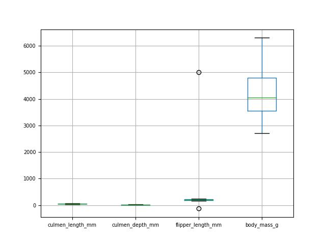
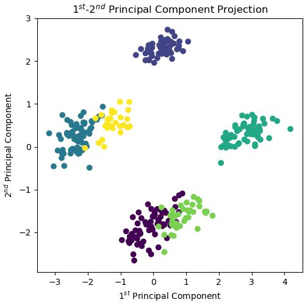
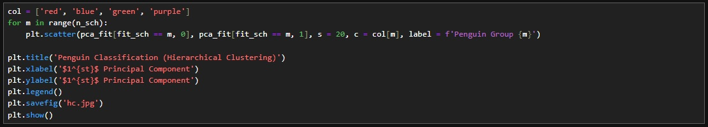

# Penguins_Unsupervised_Classification

This is a project that aims to group penguins with 3 unsupervised machine learning methods: K-Means Clustering, Hierarchical Clustering and  Density-Based Spatial Clustering of Applications with Noise (DBSCAN). The dataset, can be found in the current directory in .csv format.

The project is presented in the following structure:

**1. Data Access and Processing**

**2. Data Visualization**
   
**3. Principal Component Analysis (PCA)**
   
**4. K-Means Clustering**   

**5. Hierarchical Clustering**   

**6. Density-Based Spatial Clustering of Applications with Noise (DBSCAN)**

Let's do this.
*****************************************************************************************************************
# 1. Data Access and Processing

# 2. Data Visualization

# 3. Principal Component Analysis (PCA)

# 4. K-Means Clustering

# 5. Hierarchical Clustering

# 6. Density-Based Spatial Clustering of Applications with Noise (DBSCAN)

